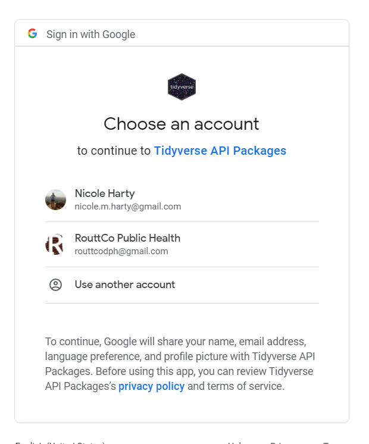

```{r setup, include=FALSE}
knitr::opts_chunk$set(echo = FALSE)
```

## Goals
Explain file directories, file types, and project structure  
Install and use major packages to import data and create data frames  

## Introductions  
Name  
Where you work  
Favorite thing about SPRING  

## Software Structure and Nomenclature  
  
- Base R vs RStudio  
- [https://cran.r-project.org/](CRAN and packages)
- Look and Feel of RStudio  

## File Types and Directories  
  
- .Rproj
- .R  
- Directories = file paths or folders, important for accessing files  


## Packages  
  
- Opening files: openxlsx, readr
- Data analysis: psych, lme4, likert
- Data wrangling: tidyverse (dplyr, forcats, stringr)  
- Dates: lubridate  
- Data visualization: ggplot2, plotly
- Working with Common Online Data Sources: googlesheets, qualtRics  
- RMarkdown: knitr, rmarkdown  

## Load Data, Review  

- Data types  
- Environment viewer  
- View dataset  

## Google API Connection  



## Resources and Help 

- [R Studio Community](https://community.rstudio.com/)  
- [RStudio Cheatsheets](https://rstudio.com/resources/cheatsheets/)  
- [R for Data Science - the "Bible"](https://r4ds.had.co.nz/)
- [https://stackoverflow.com/questions/tagged/r](Stack Overflow)  
- [R for the Rest of Us](https://rfortherestofus.com/) also Twitter @rfortherest
- @WeAreRLadies on Twitter  
- Github repositories / comments for specific packages  

